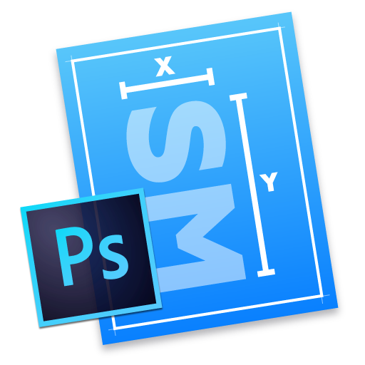
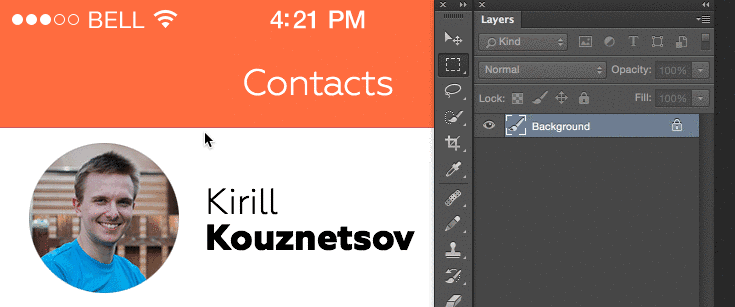

# Size Marks

Size Marks is a helpful Photoshop script for web designers and front-end engineers.

Script converts rectangular marquee to labeled measurement mark. Landscape marquee → horizontal mark. Portrait or square marquee → vertical mark.

### Install

1. Download and unzip: [Size-Marks.jsx-v1.0.zip].
2. Place `Size Marks.jsx` in the Photoshop Scripts folder. If you have more than one version of Photoshop, place the script in the Scripts folder of each version.
 - OS X: `/Applications/[Photoshop]/Presets/Scripts/`
 - Windows: `C:\[Program Files]\Adobe\[Photoshop]\Presets\Scripts`
4. Restart Photoshop. The script should now be available in `File ▸ Scripts ▸ Size Marks`.
5. Next, let’s make a shortcut. `Edit ▸ Keyboard Shortcuts...`. Unwrap `File` and scroll to `Scripts>`. Select `Size Marks` and set the shortcut.

**Recommended shortcut key** (must not already be in use)

- OS X: `Shift+Cmd+P`
- Windows: `Shift+Ctrl+P`

[Size-Marks.jsx-v1.0.zip]: https://cdn.rawgit.com/romashamin/Size-Marks-PS/master/Size-Marks.jsx-v1.0.zip

### Usage

Create a rectangular selection with Rectangular Marquee Tool (M) and use your shortcut (see Install section).

### System Requirements

The script has been tested on Photoshop CC 2014 on OS X Yosemite. If you have any problems, drop me a line: [@romanshamin].

[@romanshamin]: https://twitter.com/romanshamin

### Thanks

[c.pfaffenbichler]: https://forums.adobe.com/people/c.pfaffenbichler
[Evil Martians]: http://evilmartians.com/

### For Satisfied Pro’s

If you’re a professional web developer:
* Use Size Marks for free and pay with a tweet/post
* Buy me a cup of pu-erh tea: [pay $3 by PayPal]

[pay $3 by PayPal]: https://www.paypal.com/cgi-bin/webscr?cmd=_s-xclick&hosted_button_id=AWYVPVCBHEJXA

### Testimonials [✍]

[✍]: https://twitter.com/search?f=realtime&q=Size%20Marks&src=typd

- Just what I needed. [⚑]
<small>— Erik Myers, Mountain View, California.</small>

[⚑]: https://twitter.com/endswithak/status/528967796491681793

- Tu fais des maquettes/spéc sous Photoshop? Voila une petite extension sympa pour placer des marques de mesure. [✌]
<small>— LegZ, Lyon, France.</small>

[✌]: https://twitter.com/legz/status/528459513943564288

- Перепробовал кучу всяких «образмеривалок» для Ps, но этот простейший скрипт пока кажется одним из самых юзабельных. [★]
<small>— Андрей Сундиев, Яндекс, Москва.</small>

[★]: https://twitter.com/ASundiev/status/526640119777083392

- 選択範囲を作るだけで数値がレイヤーに書きだされる！？これは便利だ！ [☼]
<small>— ヤマシタヒトシ, 愛知県あま市</small>

[☼]: https://twitter.com/yamachan_ck/status/528374075224096768

- Шикарная вещь, как я раньше жил без Size Marks. [☂]
<small>— Александр Курганов, Санкт-Петербург.</small>

[☂]: https://twitter.com/Akurganow/status/527734891144704000

- Made my day! [♬]
<small>— Michl, Germany, NRW.</small>

[♬]: https://twitter.com/stil72/status/528092783169794049

- 確かに作業指示書の作成が楽になりそう。ワンアクションで寸法線と値を書き出してくれるのは便利。 [⌘]
<small>— Torii, 静岡県浜松市</small>

[⌘]: https://twitter.com/torii/status/528000623921201153

- Nice little PS plugin for handing over designs quickly. [✈]
<small>— Sebastian Stockmarr, Copenhagen, Denmark.</small>

[✈]: https://twitter.com/stockmarr/status/528897988220178432

P. S. Thanks to all the users for the great feedback!

### License

Copyright © 2014 Roman Shamin https://github.com/romashamin

Size Marks is licensed under the MIT licence. All rights not explicitly granted in the MIT license are reserved. See the included LICENSE file for more details.
